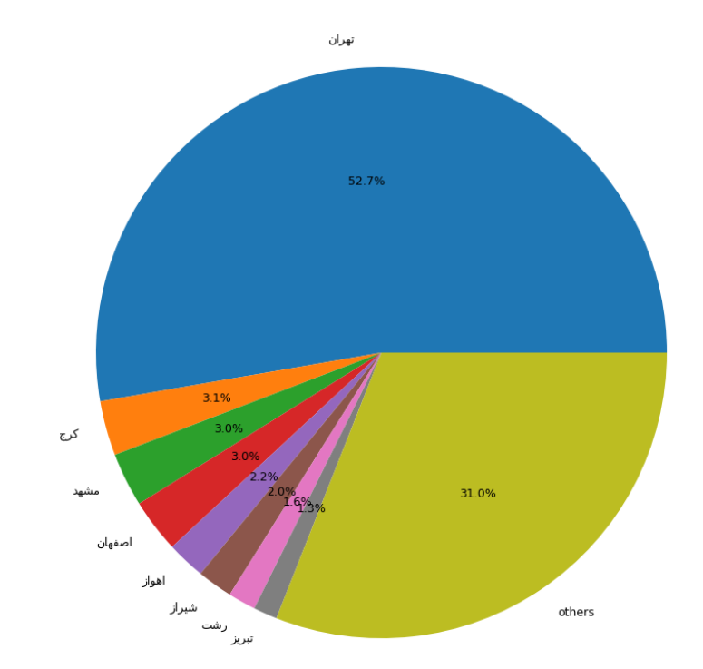

# Machine_learning_6

## digikala data set :

### - show information and add YearMonth column :

### - show infos on plot by matplotlib library :

### - finaly, show the rate of actives cities by pie plot :

---

# solve Abalone data set by Regression :

## -Use MAE,MSE,Huber,Hinge for calculate loss 

# QR Code Reader :
 
- Detecte and Decod a QRCode with QRCodeDetector function of Opencv :

. Use detectAndDecode() method 